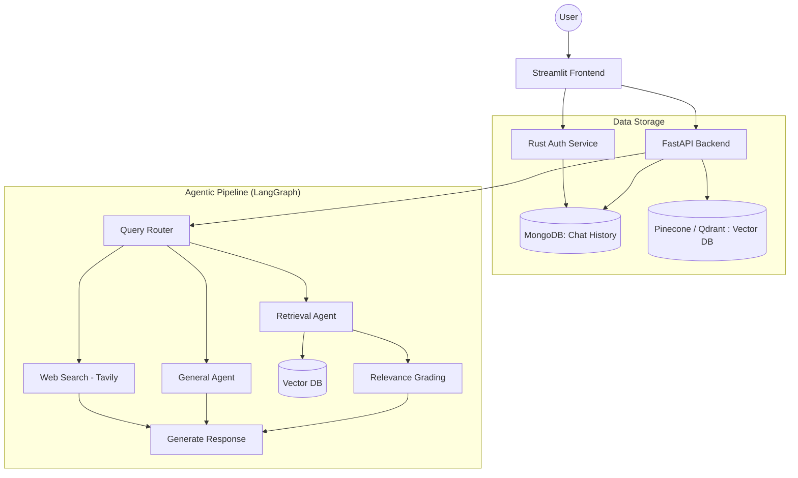
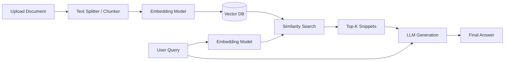
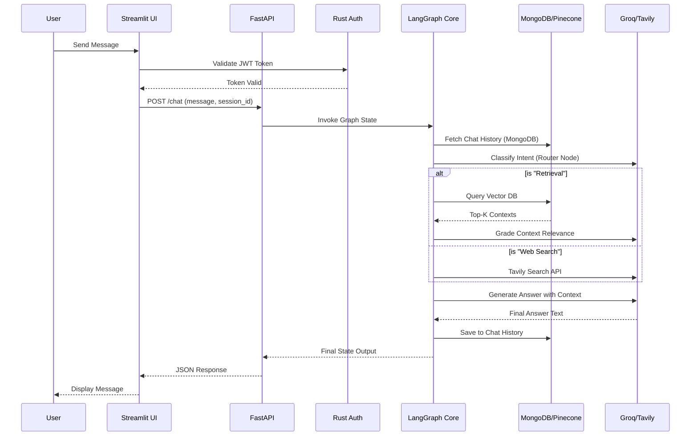
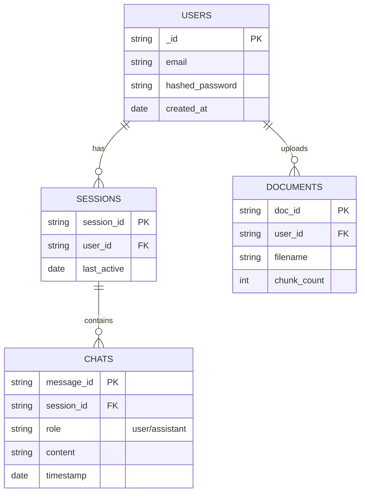

# System Architecture & Design

This document provides a detailed overview of the GraphFlow system architecture, data flow, and component relationships.

## 1. High-Level Architecture

GraphFlow leverages a modern microservice-inspired architecture separating the frontend, backend, and an extremely fast authentication service. 

### Key Components

1. **Frontend (Streamlit):** Provides a rapid, customizable interface for users to chat and upload context documents.
2. **Core Backend (FastAPI):** Handles business logic, document chunking, and orchestration of the AI pipeline.
3. **Authentication (Rust):** Written in Rust for maximum performance and security. Handles JWT issuance and validation.
4. **Agent Orchestrator (LangGraph):** The brain of the system, determining if a query needs vector retrieval, general LLM knowledge, or live web search.
5. **Persistence Models:**
   - **MongoDB:** Stores users, persistent sessions, and message chat history.
   - **Pinecone/Qdrant:** Vector databases storing high-dimensional embeddings of user documents.

---

## 2. RAG Data Flow (Ingestion & Retrieval)

When a user uploads a document, it follows a strict pipeline to ensure it is accurately embedded and stored.

---

## 3. Request Lifecycle (Sequence Diagram)

This outlines exactly what happens when a user sends a chat message. The system is designed to evaluate, verify, and automatically correct its retrieval strategy.

---

## 4. Entity-Relationship Diagram

The core database uses MongoDB for flexibility, but follows a strict relational pattern mentally to align user sessions and privacy.

## Security & Isolation Strategy

- **Authentication:** Rust handles token signing to prevent unauthorized access.
- **Data Isolation:** The Vector DB leverages **namespace** isolation (typically utilizing `session_id`) to guarantee that context from one user's chat is physically incapable of leaking into another's.
